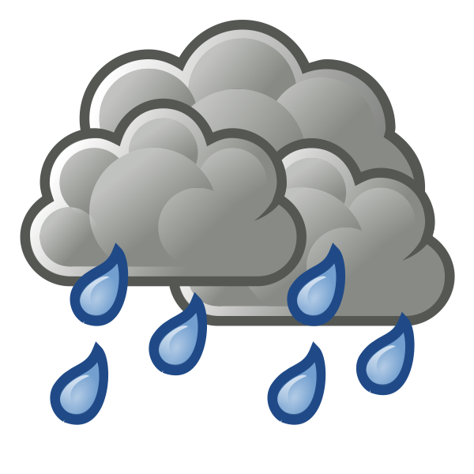

# return time of precipitation extremes

Code and example data to determine temporal shifts in intervals between extreme total annual rainfall

See blog post for a description: https://conservationbytes.com/2021/07/16/interval-between-extremely-wet-years-increasing/
